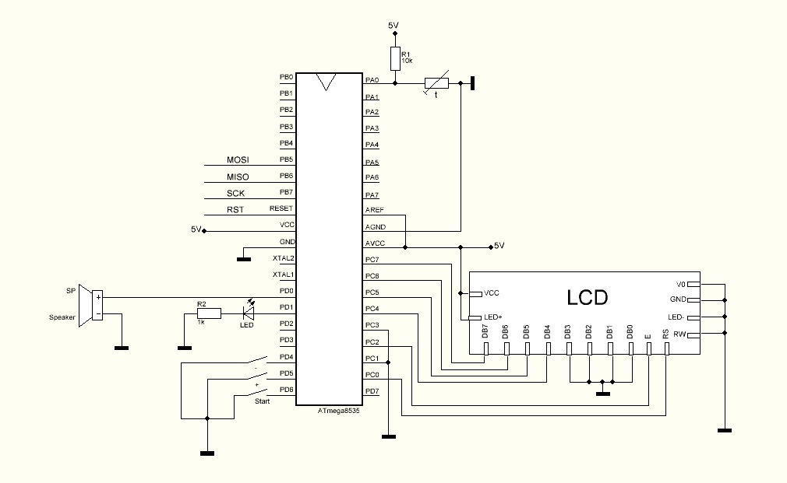

# MCU Project
MCU Project for Micro Controller Unit course, 4th semester, MIPT DREC.

## Main Function
Program tracks the cooling process for the particular substance
in order to preserve it from overcooling.
All temperature values are measured in degrees Celsius.
User can set threashold temperature (0 degree or higher)
and start the process (event is accompanied with the switched-on LED). After reaching
or getting lower than the threshold value, the sound signal is turned on until
the user stops it by pressing the button.

## Setup

Program was written for the following MCU scheme, based on ATmega8535 and WH-1602 LCD.

